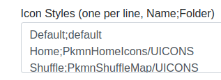

This guide assumes you have a working RDM installed. RDM supports only UIcons repositories. You can provide several styles, which are selectable in front-end. Download your Images from trusted sources, ask in Discord if you have questions. 

## Docker
* You can either embed one volume with containing image styles,
* or you embed a specific directory as volume
* `/absolut/path/to/images:/app/resources/webroot/static/img`
* or one volume for each image style, depends on you.
* RDM needs write access to the folder, it will generate a few combined images.

## Non-Docker
* Place all image styles into `resources/webroot/static/img`.
* Each style a separate folder.

## Dashboard Settings
* Add all image styles, which should be supported in the required format

## Updating
* You can update the local repository on the fly, RDM will respect the new UIcons JSON and newly added icons are supported afterwards without restarting RDM.

## Example Repositories
* [nileplumb's PkmnShuffleMap](https://github.com/nileplumb/PkmnShuffleMap/tree/master/UICONS)